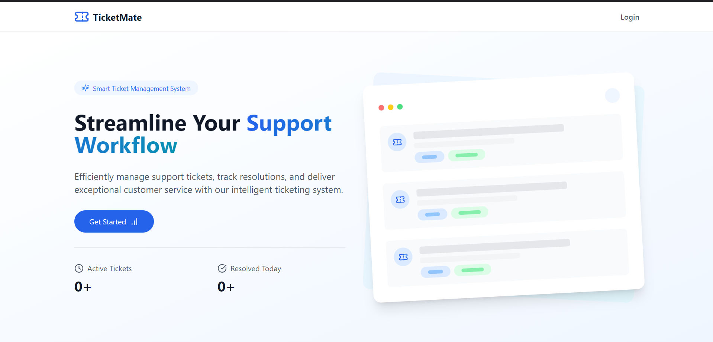
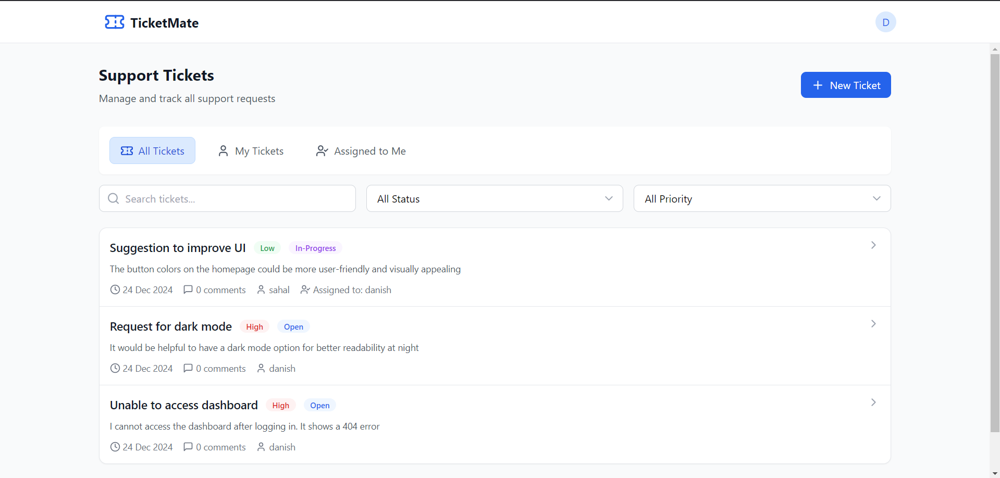

# Ticket Management System

A comprehensive ticket management system where users can raise support tickets, view their status, and administrators can manage these tickets (assign, resolve, etc.). This system comprises a **Django REST API backend** and a **React frontend**.

---

## Table of Contents

1. [Features](#features)
2. [Tech Stack](#tech-stack)
3. [Screenshots](#screenshots)
4. [Setup Instructions](#setup-instructions)
   - [Backend Setup](#backend-setup)
   - [Frontend Setup](#frontend-setup)
5. [API Endpoints](#api-endpoints)

---

## Features

- **User Authentication**: Secure login and registration using JWT.
- **Ticket Management**:
  - Users: Create, update, delete, and view their own tickets.
  - Admins: Assign tickets, change statuses, and delete any ticket.
- **Role-based Permissions**:
  - Admins: Manage all tickets.
  - Users: Manage only their own tickets.
- **Admin Dashboard**: A centralized panel for managing tickets.
- **User Dashboard**: Personalized view for managing individual tickets.

---

## Tech Stack

- **Backend**: Django, Django REST Framework, PostgreSQL
- **Frontend**: React, Tailwind CSS (or Material UI)
- **Authentication**: JWT (JSON Web Token)
- **Containerization**: Docker and Docker Compose

---

## Screenshots

### 1. Landing Page


### 2. User Dashboard


### 3. Admin Dashboard


### 4. Admin Detail Page


---

## Setup Instructions

### Backend Setup

1. **Clone the repository**:
    ```bash
    git clone <repository-url>
    cd <project-folder>/backend
    ```

2. **Set up a virtual environment**:
    ```bash
    python -m venv venv
    source venv/bin/activate   # On Windows: venv\Scripts\activate
    ```

3. **Install backend dependencies**:
    ```bash
    pip install -r requirements.txt
    ```

4. **Set up environment variables**:
    Create a `.env` file in the `backend` directory with the following:
    ```plaintext
    SECRET_KEY='your-django-secret-key'
    DEBUG=False
    DB_NAME='ticketpro_db'
    DB_USER='postgres'
    DB_PASSWORD='your-database-password'
    DB_HOST='ticket-db'
    DB_PORT='5432'
    ALLOWED_HOSTS=127.0.0.1
    CSRF_TRUSTED_ORIGINS=http://localhost:5173
    CORS_ALLOWED_ORIGINS=http://localhost:5173
    ```

5. **Run database migrations**:
    ```bash
    python manage.py migrate
    ```

6. **Create a superuser**:
    ```bash
    python manage.py createsuperuser
    ```

7. **Run the development server**:
    ```bash
    python manage.py runserver
    ```

The backend will be available at `http://127.0.0.1:8000`.

---

### Frontend Setup

1. **Navigate to the frontend directory**:
    ```bash
    cd ../frontend
    ```

2. **Install dependencies**:
    ```bash
    npm install
    ```

3. **Start the development server**:
    ```bash
    npm run dev
    ```

The frontend will be available at `http://localhost:5173`.

---

## API Endpoints

### Authentication

- **POST** `/api/register/`: Register a new user.
- **POST** `/api/token/`: Obtain JWT tokens (login).
- **POST** `/api/token/refresh/`: Refresh the JWT token.
- **POST** `/api/logout/`: Log out (invalidate refresh token).

### Ticket Management

- **GET** `/api/tickets/`: List all tickets.
- **POST** `/api/tickets/`: Create a new ticket.
- **GET** `/api/tickets/{id}/`: View details of a specific ticket.
- **PUT** `/api/tickets/{id}/`: Update a ticket.
- **DELETE** `/api/tickets/{id}/`: Delete a ticket.

### Comments

- **GET** `/api/comments/`: List comments for a ticket.
- **POST** `/api/comments/`: Add a comment to a ticket.

---
